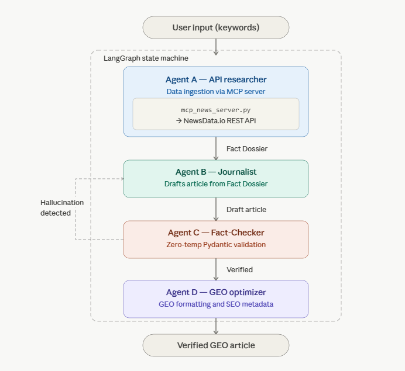

# Multi-Agent Editorial & Fact-Verification Loop

**Live Demo:** [Click here to test the Streamlit web app](https://huggingface.co/spaces/ying2sun/MultiAgent-Editorial-Workflow) *(Requires your own OpenRouter and NewsData API keys.)*

A stateful, independent open-source multi-agent AI system that autonomously researches, drafts, fact-checks, and GEO-optimizes news articles, with a built-in hallucination correction loop. Built with LangGraph and deployed on Streamlit.

---

## Design Context

This system was designed to solve real editorial production problems observed in a media organization context. The architecture reflects production requirements: hallucination correction cannot be optional, GEO formatting must be deterministic, and agent responsibilities must be isolated for auditability.

A related production pipeline built on these same design principles delivered measurable outcomes at a regional news organization: +52.5% organic search growth, +42% monthly page views, and 40% reduction in content cycle time over six months.

---

## System Architecture

The workflow enforces the **Single Responsibility Principle** across four isolated agents, orchestrated as a stateful LangGraph graph:



> *Architecture: User keywords flow through API Researcher -> Journalist -> Fact-Checker (with hallucination re-routing loop) -> GEO Optimizer -> Verified article output. All state transitions managed by LangGraph.*

### Agent Responsibilities

**Agent A: API Researcher**
Invokes a standalone MCP (Model Context Protocol) server (`mcp_news_server.py`) via stdio transport to retrieve live, grounded news data from NewsData.io. The MCP server exposes the API call as a standardized tool endpoint, decoupling the data source from the orchestration layer. Extracts a structured "Fact Dossier" which is a set of verifiable claims and source URLs that constrains all downstream agents.

**Agent B: Journalist**
Drafts a narrative article strictly from the facts in the Dossier. Has no access to external knowledge, preventing confabulation at the drafting stage.

**Agent C: Fact-Checker**
The critical logic gate. Uses Pydantic structured output at Temperature=0.0 to cross-reference the draft against the original Dossier. If unverified claims (hallucinations) are detected, it routes the draft back to Agent B with targeted correction instructions. Only a fully verified draft advances.

**Agent D: GEO Optimizer**
Transforms the verified draft into a GEO-formatted article: structured markdown layout, SEO metadata, and heading hierarchy optimized for AI search citation (Perplexity, ChatGPT, Google AI Overviews).

---

## Technology Stack

| Layer | Technology |
|---|---|
| Orchestration | LangGraph + LangChain |
| LLM | Google Gemini 2.5 Flash (via OpenRouter) |
| Data ingestion | NewsData.io REST API |
| MCP server | FastMCP (mcp library) |
| MCP client | langchain-mcp-adapters |
| Structured validation | Pydantic |
| Frontend | Streamlit |
| Deployment | Streamlit Community Cloud |

---

## MCP Architecture

Agent A's data retrieval is implemented as a standalone **Model Context Protocol (MCP) server** (`mcp_news_server.py`). Rather than calling the NewsData.io REST API directly inside the LangGraph agent function, the workflow spawns the MCP server as a subprocess and communicates with it over stdio via `langchain-mcp-adapters`.

The MCP server exposes a single `fetch_news` tool endpoint. The LangGraph agent calls this tool through the standardized MCP protocol rather than a hardcoded API call. This decouples the data source from the orchestration layer: the news API can be swapped for any other source whatever a database, a web scraper, a different feed without modifying the agent or graph logic.

```
User Keywords
     |
     v
[LangGraph Workflow]
     |
     v
[MCP Client] --stdio--> [mcp_news_server.py] --> NewsData.io API
     |
     v
Fact Dossier -> Agent B -> Agent C -> Agent D
```

---

## Key Design Decisions

**Why MCP for data ingestion?**
Hardcoding an API call inside an agent function couples the data source to the orchestration logic. Exposing it as an MCP tool endpoint creates a clean interface boundary: the agent declares what data it needs, and the MCP server handles how to retrieve it. This mirrors production microservice patterns and makes the data layer independently testable and swappable.

**Why LangGraph over a simple chain?**
LangGraph enables stateful, cyclical graphs, which are essential for the hallucination correction loop. A standard LangChain chain cannot route an agent's output back to a previous agent based on a validation result.

**Why Temperature=0.0 for the Fact-Checker?**
The Fact-Checker is a logic gate, not a creative agent. Deterministic output from Pydantic structured extraction at Temperature=0.0 ensures the validation decision is reproducible and auditable, not stochastic.

**Why separate the Researcher and Journalist?**
Isolating data retrieval from drafting enforces a hard boundary between grounded facts and generated narrative. This is the architectural equivalent of a source/generation separation — it makes hallucination detection tractable.

---

## How to Run Locally

This application does not hardcode or store API keys.

1. Clone the repository
2. Create a virtual environment and install dependencies:
   ```bash
   pip install -r requirements.txt
   ```
3. Launch the Streamlit interface:
   ```bash
   streamlit run app.py
   ```
4. In the sidebar, enter your **OpenRouter API Key** and **NewsData API Key**
5. Enter search keywords and click **Generate Verified Article**

> Note: `mcp_news_server.py` is spawned automatically as a subprocess when the workflow runs. No separate server startup is required.

---

## About

Built as an independent project demonstrating production-grade agentic AI architecture. Part of a data science portfolio focused on LangGraph, MCP, and Generative Engine Optimization (GEO).
